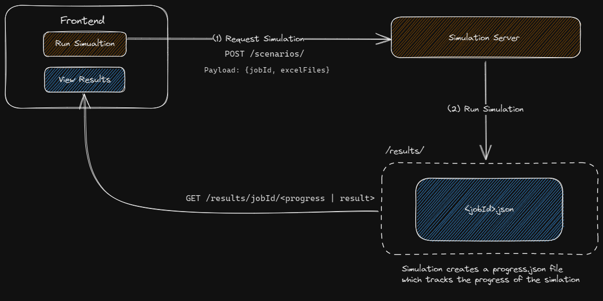

# Job Handling

## Overview

When we run a simulation (which we will refer as a job), we need to make a request to the simulation server (a python server) that runs the simulation in _the background_, the simulation takes some time to run, so we do not wait for the simulation to finish, instead we tell the user that the simulation is running.



Once a job is invoked, the simulation server will start running the simulation, we require that the simulation server outputs the files:

- `<jobId>.json`: a file that contains the result of the simulation

The front end will poll the simulation server for the progress of the simulation, where the simulation server will return the `progress.json` file, the front end will then update the progress bar accordingly. If the simulation is finished, the front end will then request the `result.json` file, and display the result to the user.

## Simulation files

A job is tagged with a `jobId` which is used to identify the job. Then the JSON files will be saved under the directory `./results/`.

```bash filename="/results/"
├── <jobId>.json
```

### Progress file

The schema for the progress file is as follows:

```json
{
  "progress": 0.5,
  "id": "<jobId>"
  "created": 1620000000, // unix timestamp
  "num_reps": "1", // number of repititions
  "results": [
    {...}, // Scenario 1
    {...}, // Scenario 2
    {...}, // Scenario 3
    ...
  ]
}
```

The JSON schema for scenarios can be found in the JSON schema page
