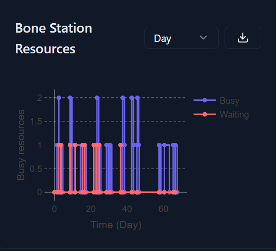

# Scenario JSON Schema

The example results page for the [Scenario](https://digital-twin-web-delta.vercel.app/digital-hospital/jobs/results?id=job-2),
shows the requirements in terms of data. We would need to encapsulate all of this in the JSON schema. Have this website as a reference @Yin-Chi.

## Results Section


The first banner contains the overall TAT in hours, and then the 7, 10, 12, 21 day progress of the samples with reference to the RCPath
targets. The second banner contains the Lab TAT (which I believe is the time taken for the sample to get to the lab, noy 100% sure), then we have another 3 day progress bar.

```json filename="JSON Schema"
{
  "results": {
    "overallTAT": 90,
    "progress": {
      "7": 0.5,
      "10": 0.9,
      "12": 0.92,
      "21": 0.99
    },
    "labTAT": 20,
    "labProgress": {
      "3": 0.5
    }
  }
  ...
}
```

## Output Analysis

import { Callout } from "nextra/components";

<Callout>
  Please not the "Stages" that I used may not be the same as the ones used in
  the simulation. I just used a random set of stages to show the idea. Please
  use the stages from the simulation.
</Callout>

### TAT by Stage


Here we have the TAT by stage, with actual and target TAT.
I don't think we have the target TATs yet! We would need to get this from the HistoPath lab!!! For now, it can be hardcoded in the backend. The structure for this follows the BarChartData types defined in [this page](/packages/charts/bar)

```json filename="JSON Schema"
{
  "tat_by_stage": {
    "data": {
      "x": stages, // array of stages from the simulation
      "y": [
        [10, 12, 14, 16, 18, 20, 22, 24, 26, 28, 30, 10, 12], // target TAT
        [20, 18, 16, 14, 12, 10, 30, 12, 40, 20, 30, 10, 12] // actual TAT
      ],
      "labels": ["Target", "Actual"]
    },
    "xlabel": "Stages",
    "ylabel": "TAT",
    "title": "TAT by Stage"
  }
}
```

### Resource Allocation

For this we will have graphs for each resource and how it is being utilized.

<Callout type="warning">
  @Yin-Chi, please ensure that the line data has minimal points, as we don't
  want to overload the browser with too many points. Only show the points that
  are necessary, we do not need to show a point every 0.1s.
</Callout>

An example graph:



We would have a graph like this for all the resources availbile. The data type follows the [LineChartData](/packages/charts/line) that is mentioned in
[this page](/packages/charts/line)

This graph was taken from the old simulation and current the data looks like this.

```json
{
  "data": {
    "x": [boneStationData.busy.data.x, boneStationData.waiting.data.x],
    "y": [boneStationData.busy.data.y, boneStationData.waiting.data.y] // array of arrays
  },
  "labels": ["Busy", "Waiting"],
  "xlabel": "Time (hours)",
  "ylabel": "Busy resources",
  "title": "Bone Station Resources"
}
```

As you can see we have different x values for each line, this is because the data is not sampled at the same time. We would need to
ajust the data so that it is sampled at the same time, this is more optimal and makes it easier to download the data in a nice format

So something like this

```json
{
  "data": {
    "x": commonXArray,
    "y": [boneStationData.busy.data.y, boneStationData.waiting.data.y] // array of arrays
  },
  "labels": ["Busy", "Waiting"],
  "xlabel": "Time (hours)",
  "ylabel": "Busy resources",
  "title": "Bone Station Resources"
}
```

Then for every resource we would have a graph like this. Final schema.

```json filename="JSON Schema"
{
  "resouce_allocation": [
    {...}, // Type [LineChartData](/packages/charts/line)
    {...},
    {...},
    ...
  ]
}
```

## Resource Utilizaation

### Utilization By Stage


Here we are plotting the percent utilization by stage. The data type follows the [BarChartData](/packages/charts/bar). Eg

```json filename="JSON Schema"
{
  "utilization_by_stage": {
    "data": {
      "x": stages, // array of stages from the simulation
      "y": [[100, 50, 60, 60, 20, 100, 20, 24, 70, 80, 80, 90, 100]], // array of arrays, inner array is the utilization for each stage
      "labels": ["% Average Utilization"]
    },
    "xlabel": "Stages",
    "ylabel": "% Average Utilization",
    "title": "% Average Utilization by Stage"
  }
}
```

### Daily Utilization by Stage


Here we plot how the utilization for stage varies per day of the simulation. Data type follows the [LineChartData](/packages/charts/line) as mentioned before.

```json filename="JSON Schema"
{
  "daily_utilization_by_stage": {
    "data": {
      "x": [...], // array of days
      "y": [[...], [...], ...] // array of arrays, inner array is the utilization for each stage
    },
    "labels": stages, // array of stages from the simulation,
    "xlabel": "Stages (days)",
    "ylabel": "TAT",
    "title": "TAT by Stage",
  }
}
```

## Final Schema

```json filename="Final Schema"
{
  "results": {
    "overallTAT": "number",
    "progress": {
      "7": "number < 1",
      "10": "number < 1",
      "12": "number < 1",
      "21": "number < 1"
    },
    "labTAT": "number",
    "labProgress": {
      "3": "number < 1"
    }
  },
  "tat_by_stage": "BarChartData",
  "resource_allocation": ["LineChartData", "LineChartData", ...],
  "utilization_by_stage": "BarChartData",
  "daily_utilization_by_stage": "LineChartData"
}
```

Or in Typescript

```tsx
type Results = {
  overallTAT: number;
  progress: {
    [stage: number]: number;
  };
  labTAT: number;
  labProgress: {
    [stage: number]: number;
  };
};

type Data = {
  tat_by_stage: BarChartData;
  resource_allocation: LineChartData[];
  utilization_by_stage: BarChartData;
  daily_utilization_by_stage: LineChartData;
};

export type SimulationResults = Results & Data;
```
