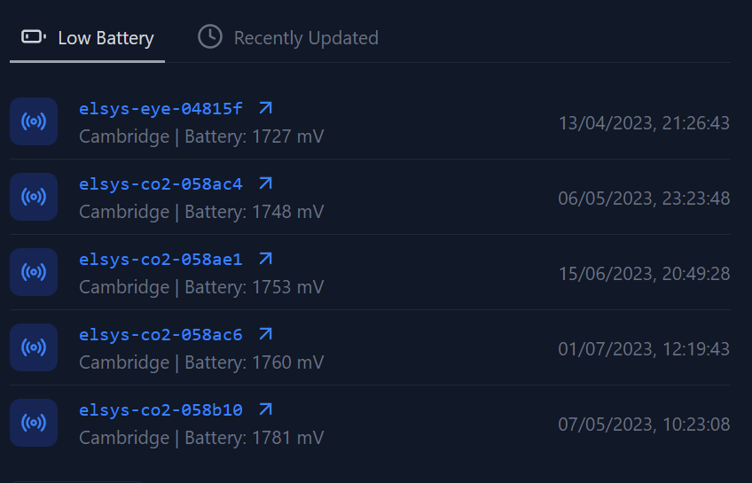

# Medium Example

In this example, we will create the tab list of sensors that is displayed on the home page.



import { Steps } from "nextra/components";

<Steps>

### Define Component

We will define the component under the `components/home/sensors.tsx` file.

```tsx showLineNumbers
// ! IMPORTS OMITTED FOR BREVITY
interface SensorsViewProps {
  numberOfItems?: number;
}

const SensorsView: React.FC<SensorsViewProps> = ({ numberOfItems = 5 }) => {
  const [sensorTabIndex, setSensorTabIndex] = React.useState(0);

  // TODO: Fetch data from WS

  return (
    <TabGroup
      color="amber"
      index={sensorTabIndex}
      onIndexChange={(index) => setSensorTabIndex(index)}
    >
      <TabList className="mt-8">
        <Tab
          icon={BatteryLow}
          className={
            sensorTabIndex === 0
              ? "border-b-2 border-black text-black dark:border-gray-400 dark:text-gray-300"
              : ""
          }
        >
          Low Battery
        </Tab>
        <Tab
          icon={Clock}
          className={
            sensorTabIndex === 1
              ? "border-b-2 border-black text-black dark:border-gray-400 dark:text-gray-300"
              : ""
          }
        >
          Recently Updated
        </Tab>
      </TabList>
      <TabPanels>
        <TabPanel>{/* Insert Data */}</TabPanel>
        <TabPanel>{/* Insert Data */}</TabPanel>
      </TabPanels>
    </TabGroup>
  );
};

export default SensorsView;
```

This a very simple tabs component that will display the data in the two tabs. One for recently updated sensors and one for sensors with low battery.
We currently now have this 

### Fetch Data

Now we will get all the latest records using the `useRecords` hook (see [here](/web/websocket/use-records)])

```tsx showLineNumbers {8, 39-40}
interface SensorsViewProps {
  numberOfItems?: number;
}

const SensorsView: React.FC<SensorsViewProps> = ({ numberOfItems = 5 }) => {
  const [sensorTabIndex, setSensorTabIndex] = React.useState(0);

  const { records } = useRecords();

  return (
    <TabGroup
      color="amber"
      index={sensorTabIndex}
      onIndexChange={(index) => setSensorTabIndex(index)}
    >
      <TabList className="mt-8">
        <Tab
          icon={BatteryLow}
          className={
            sensorTabIndex === 0
              ? "border-b-2 border-black text-black dark:border-gray-400 dark:text-gray-300"
              : ""
          }
        >
          Low Battery
        </Tab>
        <Tab
          icon={Clock}
          className={
            sensorTabIndex === 1
              ? "border-b-2 border-black text-black dark:border-gray-400 dark:text-gray-300"
              : ""
          }
        >
          Recently Updated
        </Tab>
      </TabList>
      <TabPanels>
        <TabPanel>{JSON.stringify(records)}</TabPanel>
        <TabPanel> {JSON.stringify(records)}</TabPanel>
      </TabPanels>
    </TabGroup>
  );
};

export default SensorsView;
```

Which looks like


### Filter Data

We want to filter out the data with the lowest batteries and also the most recently updated. We will make a helper function that returns both of these in a specifed type.

```tsx showLineNumbers {54-98, 47-48, 10-17}
interface SensorsViewProps {
  numberOfItems?: number;
}

const SensorsView: React.FC<SensorsViewProps> = ({ numberOfItems = 5 }) => {
  const [sensorTabIndex, setSensorTabIndex] = React.useState(0);

  const { records } = useRecords();

  if (!records) {
    return null; // return null if loading
  }

  const { lowBatteryData, recentlyUpdatedData } = filterData(
    records,
    numberOfItems
  );
  return (
    <TabGroup
      color="amber"
      index={sensorTabIndex}
      onIndexChange={(index) => setSensorTabIndex(index)}
    >
      <TabList className="mt-8">
        <Tab
          icon={BatteryLow}
          className={
            sensorTabIndex === 0
              ? "border-b-2 border-black text-black dark:border-gray-400 dark:text-gray-300"
              : ""
          }
        >
          Low Battery
        </Tab>
        <Tab
          icon={Clock}
          className={
            sensorTabIndex === 1
              ? "border-b-2 border-black text-black dark:border-gray-400 dark:text-gray-300"
              : ""
          }
        >
          Recently Updated
        </Tab>
      </TabList>
      <TabPanels>
        <TabPanel>{JSON.stringify(lowBatteryData)}</TabPanel>
        <TabPanel> {JSON.stringify(recentlyUpdatedData)}</TabPanel>
      </TabPanels>
    </TabGroup>
  );
};

type FilteredData = {
  name: string;
  description?: string;
  location: string;
  timestamp: number;
};

const filterData = (data: RecordType[], numOfItems: number) => {
  const lowBatteryData: FilteredData[] = [];
  const recentlyUpdatedData: FilteredData[] = [];

  // lowBatteryData filtering
  let dataWithVdd = data.filter((item) => item.payload?.vdd !== undefined);
  // sort data by vdd (asc)
  dataWithVdd.sort((a, b) => a.payload.vdd - b.payload.vdd);
  // get the first numOfItems
  dataWithVdd = dataWithVdd.slice(0, numOfItems);
  // map to FilteredData
  dataWithVdd.forEach((item) => {
    lowBatteryData.push({
      name: item.acp_id,
      description: `Battery: ${item.payload.vdd} mV`,
      location: "Unknown", // TODO
      timestamp: parseFloat(item.acp_ts),
    });
  });

  // recentlyUpdatedData filtering
  // sort data by timestamp (desc)
  data.sort((a, b) => parseFloat(b.acp_ts) - parseFloat(a.acp_ts));
  // get the first numOfItems
  data = data.slice(0, numOfItems);
  // map to FilteredData
  data.forEach((item) => {
    recentlyUpdatedData.push({
      name: item.acp_id,
      location: "Unknown", // TODO
      timestamp: parseFloat(item.acp_ts),
    });
  });

  return {
    lowBatteryData,
    recentlyUpdatedData,
  };
};

export default SensorsView;
```

Now we have successfully filtered the data and we can see the results in the UI.


### Display Data

At the moment we just JSON stringify the data, but we want to display it nicely in a list format. With links that redirect to the live pages for the sensors, to do this, we will create a new `TabView` component, that takes in the data and displays a list.
Then we will use this component in our `SensorsView` component.

```tsx showLineNumbers {18-54, 103, 106}
import {
  Flex,
  Icon,
  List,
  ListItem,
  Tab,
  TabGroup,
  TabList,
  TabPanel,
  TabPanels,
  Text,
} from "@tremor/react";
import { ArrowUpRight, BatteryLow, Clock, Radio } from "lucide-react";
import Link from "next/link";
import React from "react";
import useRecords, { RecordType } from "~/websockets/useRecords";

interface TabViewProps {
  data: FilteredData[];
}

const TabView: React.FC<TabViewProps> = ({ data }) => {
  return (
    <List className="mt-4">
      {data.map((sensor) => (
        <ListItem key={sensor.name}>
          <Flex justifyContent="start" className="space-x-4 truncate">
            <Icon
              className={`rounded-md`}
              variant="light"
              icon={Radio}
              size="md"
            />
            <div className="truncate">
              <Link href={`/sensors/live/${sensor.name}`}>
                <div className="flex  items-center space-x-2 text-blue-500 dark:text-blue-500 ">
                  <Text className=" font-mono text-blue-500 dark:text-blue-500">
                    {sensor.name}
                  </Text>
                  <ArrowUpRight size={18} />
                </div>
              </Link>
              <Text className="truncate">
                {sensor.location} {sensor.description ? " | " : ""}
                {sensor.description}
              </Text>
            </div>
          </Flex>
          <Text>{new Date(sensor.timestamp * 1000).toLocaleString()}</Text>
        </ListItem>
      ))}
    </List>
  );
};

interface SensorsViewProps {
  numberOfItems?: number;
}

const SensorsView: React.FC<SensorsViewProps> = ({ numberOfItems = 5 }) => {
  const [sensorTabIndex, setSensorTabIndex] = React.useState(0);

  const { records } = useRecords();

  if (!records) {
    return null; // return null if loading
  }

  const { lowBatteryData, recentlyUpdatedData } = filterData(
    records,
    numberOfItems
  );
  return (
    <TabGroup
      color="amber"
      index={sensorTabIndex}
      onIndexChange={(index) => setSensorTabIndex(index)}
    >
      <TabList className="mt-8">
        <Tab
          icon={BatteryLow}
          className={
            sensorTabIndex === 0
              ? "border-b-2 border-black text-black dark:border-gray-400 dark:text-gray-300"
              : ""
          }
        >
          Low Battery
        </Tab>
        <Tab
          icon={Clock}
          className={
            sensorTabIndex === 1
              ? "border-b-2 border-black text-black dark:border-gray-400 dark:text-gray-300"
              : ""
          }
        >
          Recently Updated
        </Tab>
      </TabList>
      <TabPanels>
        <TabPanel>
          <TabView data={lowBatteryData} />
        </TabPanel>
        <TabPanel>
          <TabView data={recentlyUpdatedData} />
        </TabPanel>
      </TabPanels>
    </TabGroup>
  );
};

type FilteredData = {
  name: string;
  description?: string;
  location: string;
  timestamp: number;
};

const filterData = (data: RecordType[], numOfItems: number) => {
  const lowBatteryData: FilteredData[] = [];
  const recentlyUpdatedData: FilteredData[] = [];

  // lowBatteryData filtering
  let dataWithVdd = data.filter((item) => item.payload?.vdd !== undefined);
  // sort data by vdd (asc)
  dataWithVdd.sort((a, b) => a.payload.vdd - b.payload.vdd);
  // get the first numOfItems
  dataWithVdd = dataWithVdd.slice(0, numOfItems);
  // map to FilteredData
  dataWithVdd.forEach((item) => {
    lowBatteryData.push({
      name: item.acp_id,
      description: `Battery: ${item.payload.vdd} mV`,
      location: "Cambridge", // TODO
      timestamp: parseFloat(item.acp_ts),
    });
  });

  // recentlyUpdatedData filtering
  // sort data by timestamp (desc)
  data.sort((a, b) => parseFloat(b.acp_ts) - parseFloat(a.acp_ts));
  // get the first numOfItems
  data = data.slice(0, numOfItems);
  // map to FilteredData
  data.forEach((item) => {
    recentlyUpdatedData.push({
      name: item.acp_id,
      location: "Cambridge", // TODO
      timestamp: parseFloat(item.acp_ts),
    });
  });

  return {
    lowBatteryData,
    recentlyUpdatedData,
  };
};

export default SensorsView;
```

And voila, we have a nice looking sensor view.


</Steps>
